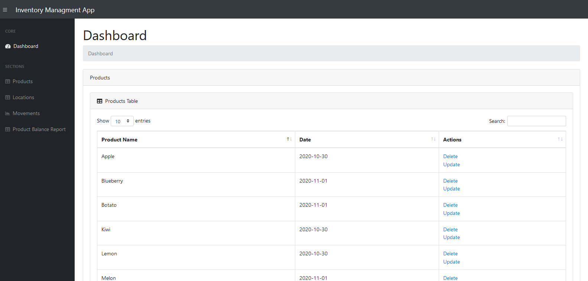
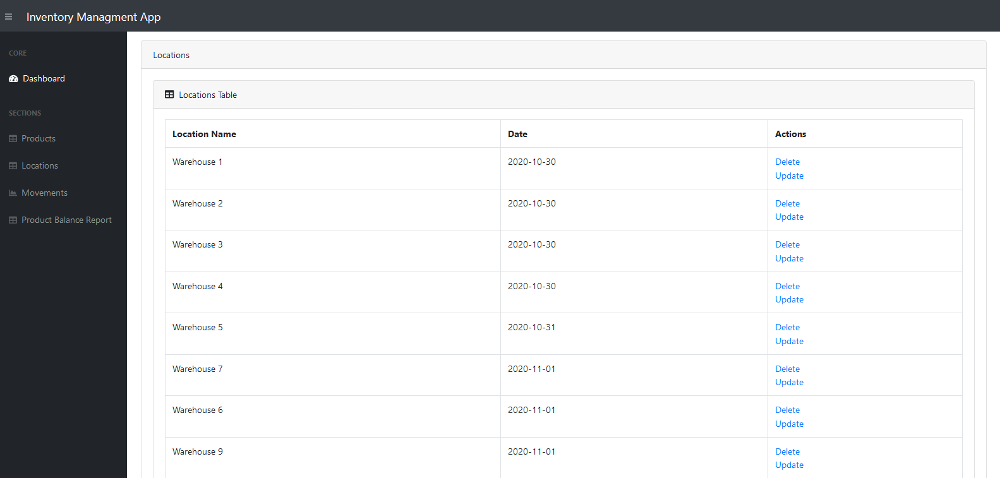
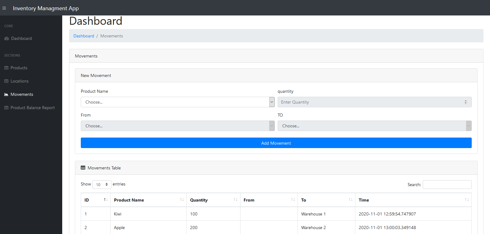
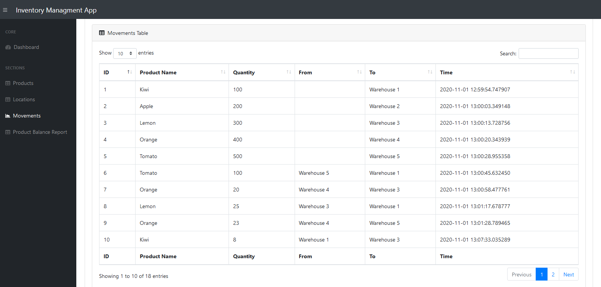

# Proyecto de gestión de inventario Flask

## Aplicación web de gestión de inventario

### El objetivo es crear una aplicación web que utilice el marco Flask para gestionar el inventario de una lista de productos en los almacenes respectivos. Imagina que esta aplicación se utilizará en una tienda o un almacén que necesita realizar un seguimiento de varios productos y varias ubicaciones.

## Python, Flask, SQLAlchemy

## Instalación

Primero, debes clonar este repositorio:

```bash
$ git clone https://github.com/DennisEdgar4080s/proyectofinal.git

Luego, cambia a la carpeta `flask-inventory-app`:

```bash
$ cd flask-inventory-app
```

Ahora, necesitaremos crear un entorno virtual e instalar todas las dependencias. Tenemos dos opciones disponibles por ahora.

Utilice Pipenv:

```bash
$ pipenv install
$ pipenv shell
```

O utilice pip + virtualenv:

```bash
$ virtualenv venv
$ . venv/bin/activate # en Windows, utilice "venv\Scripts\activate" en su lugar
$ pip install -r requirements.txt
```
## ¿Cómo ejecutar la aplicación?

**Antes de ejecutar la aplicación, asegúrese de haber activado el entorno virtual:**

```bash
$ flask run
```

## Capturas de pantalla

#### Esto muestra la primera parte del panel que contiene las secciones Productos y Ubicaciones



#### Esto muestra la segunda parte del panel mientras puede agregar y mostrar ubicaciones



#### Esto muestra la sección Movimientos que agrega movimientos y muestra todos los movimientos registrados

### También muestra la navegación de la página actual



#### a Vista previa de los registros de Movimientos



### La última muestra la página de Informe de saldo de productos, que muestra la cantidad total de cada producto en cada ubicación (almacén)

")